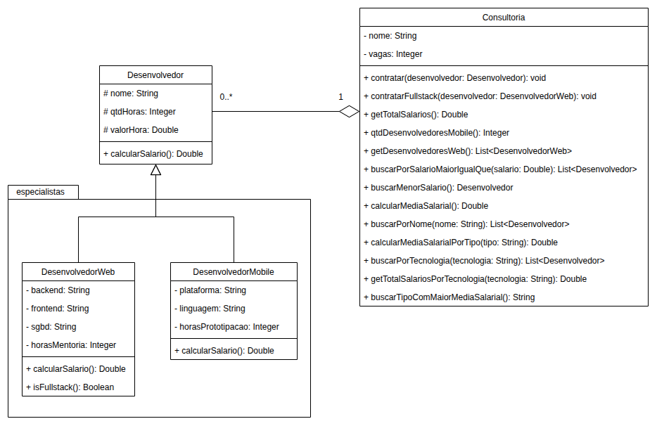

# Exercício - Herança com Agregação 📎

## Orientações Gerais 🚨

1. Utilize **apenas** tipos **wrapper** para criar atributos e métodos.
2. **Respeite** os nomes de atributos e métodos definidos no exercício.
3. Tome **cuidado** com os **argumentos** especificados no exercício.
4. **Não adicione** argumentos não solicitados e mantenha a ordem definida no enunciado.
5. Verifique se **não há erros de compilação** no projeto antes de enviar.
6. As classes devem seguir as regras de **encapsulamento**.

---

## Diagrama de classe

## Classe: `Desenvolvedor` 🚩

### Métodos Públicos

**Getters e Setters**
- Deve conter **todos** os métodos getters e setters.

**`public Double calcularSalario()`**
- **Descrição**: Calcula o salário do desenvolvedor com base nos atributos `qtdHoras` e `valorHora`.

---

## Classe: `DesenvolvedorWeb` 🖥️

### Métodos Públicos

**Getters e Setters**
- Deve conter **todos** os métodos getters e setters.

**`public Double calcularSalario()`**
- **Descrição**: Calcula o salário do desenvolvedor com base nos atributos `qtdHoras` e `valorHora`, adicionando as horas de mentoria, que valem **R$ 300,00** por hora.

**`public Boolean isFullstack()`**
- **Descrição**: Retorna `true` se o desenvolvedor for fullstack, ou seja, se os atributos `backend`, `frontend`, e `sgbd` forem diferentes de `null`.

---

## Classe: `DesenvolvedorMobile` 📱

### Métodos Públicos

**Getters e Setters**
- Deve conter **todos** os métodos getters e setters.

**`public Double calcularSalario()`**
- **Descrição**: Calcula o salário do desenvolvedor com base nos atributos `qtdHoras` e `valorHora`, adicionando as horas de prototipação, que valem **R$ 200,00** por hora.

---

## Classe: `Consultoria` 🏢

### Atributos

- A lista de desenvolvedores (`desenvolvedores`) deve ser **inicializada vazia** ao criar a consultoria, seja na declaração do atributo ou no construtor.

### Métodos Públicos

**Getters e Setters**
-  Deve conter **todos** os métodos getters e setters, **exceto** o da lista de desenvolvedores.

**`public void contratar(Desenvolvedor desenvolvedor)`**
-  **Descrição**: Adiciona o desenvolvedor à consultoria se houver vagas disponíveis.
- **Importante**: O atributo `vagas` representa um limite máximo (capacidade) de desenvolvedores e não deve ser decrementado ao contratar.

**`public void contratarFullstack(DesenvolvedorWeb desenvolvedor)`**
- **Descrição**: Adiciona o desenvolvedor fullstack à consultoria, validando se realmente é fullstack de acordo com as regras do método `isFullstack`.
- **Importante**: Assim como no `contratar`, o desenvolvedor só pode ser contratado se houver vagas disponíveis.

**`public Double getTotalSalarios()`**
- **Descrição**: Retorna a soma de todos os salários dos desenvolvedores da consultoria.

**`public Integer qtdDesenvolvedoresMobile()`**
- **Descrição**: Retorna o total de desenvolvedores mobile da consultoria.

**`public List<DesenvolvedorWeb> getDesenvolvedoresWeb()`**
- **Descrição**: Retorna uma lista com todos os desenvolvedores web da consultoria.
- **Nota**: Caso não existam desenvolvedores web, retorna uma lista vazia.

**`public List<Desenvolvedor> buscarPorSalarioMaiorIgualQue(Double salario)`**
- **Descrição**: Retorna todos os desenvolvedores com salário maior ou igual ao valor passado como argumento.

**`public Desenvolvedor buscarMenorSalario()`**
- **Descrição**: Retorna o desenvolvedor com o menor salário da consultoria.
- **Nota**: Caso a lista esteja vazia, retorna `null`.

**`public Double calcularMediaSalarial()`**
- **Descrição**: Retorna a média dos salários de todos os desenvolvedores da consultoria.
- **Nota**: Caso a lista esteja vazia, retorna `0.0`.

**`public List<Desenvolvedor> buscarPorNome(String nome)`**
- **Descrição**: Retorna os desenvolvedores cujo nome **contém** o texto passado como argumento (pode ser o nome completo ou apenas uma parte dele).
- **Regras**:
  - A busca **não** deve diferenciar letras maiúsculas de minúsculas (ex.: `"RAFA"` e `"rafa"` encontram `"Rafael"`).
  - Caso nenhum desenvolvedor seja encontrado, retorna uma lista vazia.

**`public Double calcularMediaSalarialPorTipo(String tipo)`**
- **Descrição**: Retorna a média salarial dos desenvolvedores do tipo passado como argumento, que pode ser `"comum"`, `"web"` ou `"mobile"`.
- **Regras**:
  - Considere como `"comum"` os desenvolvedores que não são `DesenvolvedorWeb` nem `DesenvolvedorMobile` (ou seja, instâncias de `Desenvolvedor`).
  - Se não houver desenvolvedores do tipo informado na consultoria, retorna `0.0`.
  - Se o tipo informado não for `"comum"`, `"web"` ou `"mobile"`, retorna `null`.

---

### Desafio ⚡

**`public List<Desenvolvedor> buscarPorTecnologia(String tecnologia)`**
-  **Descrição**: Retorna os desenvolvedores que utilizam a tecnologia passada como argumento (pode ser `frontend`, `backend`, `sgbd`, `plataforma`, ou `linguagem`).

**`public Double getTotalSalariosPorTecnologia(String tecnologia)`**
- **Descrição**: Retorna a soma dos salários dos desenvolvedores que utilizam a tecnologia especificada.
- **Nota**: Caso nenhum desenvolvedor utilize a tecnologia, retorna `0.0`.

**`public String buscarTipoComMaiorMediaSalarial()`**
- **Descrição**: Compara a média salarial dos desenvolvedores comuns, web e mobile e retorna `"comum"`, `"web"` ou `"mobile"`, conforme o tipo que tiver a **maior** média.
- **Regras**:
  - Considere como `"comum"` os desenvolvedores que não são `DesenvolvedorWeb` nem `DesenvolvedorMobile` (ou seja, instâncias de `Desenvolvedor`).
  - Compare as **médias** de cada tipo, e não a soma dos salários ou o maior salário individual.
  - Tipos sem nenhum desenvolvedor na consultoria não entram na comparação. Se só existir um tipo, retorna esse tipo.
  - Se houver empate na **maior** média entre dois ou mais tipos, retorna `null`.
  - Se a consultoria não possuir desenvolvedores, retorna `null`.
